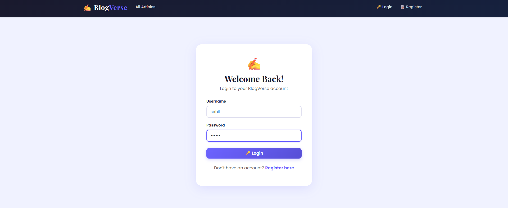
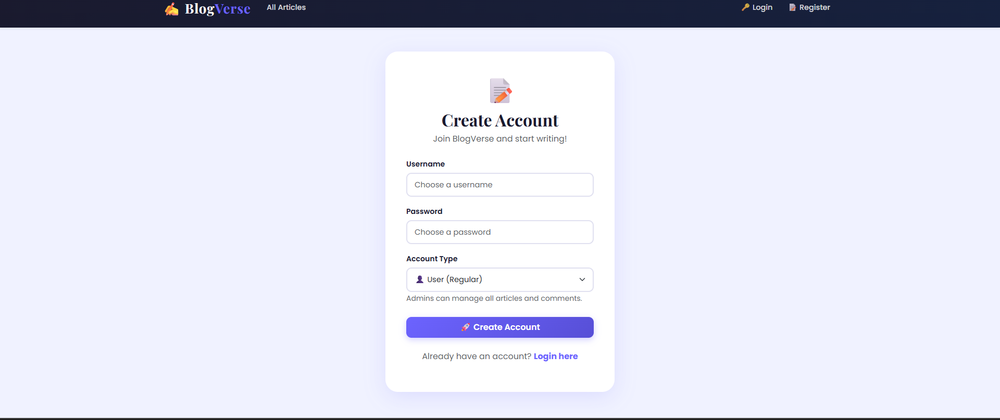
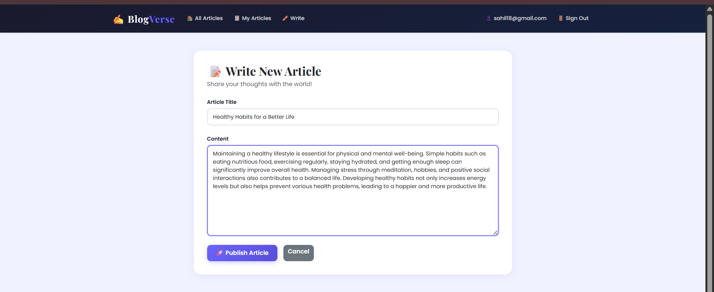
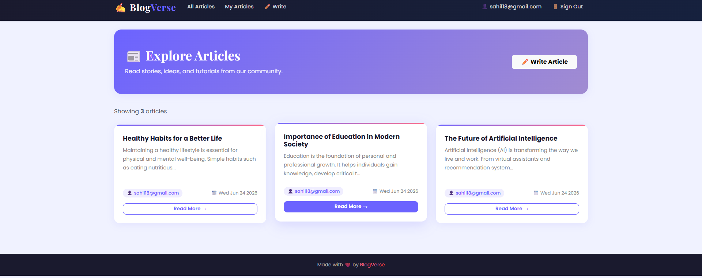
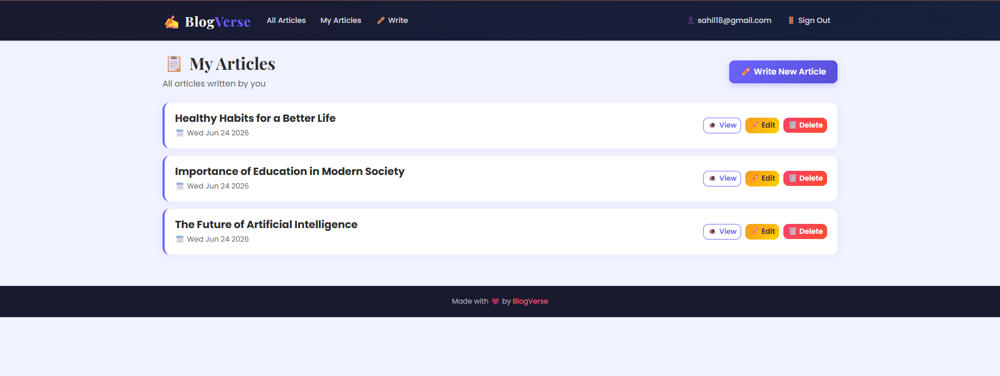

# 🚀 BlogVerse - Node.js Blog Project

A full-featured **Blog Management System** built using **Node.js, Express.js, MongoDB, EJS, JWT Authentication, Cookies, and Bootstrap**.

The application allows multiple users to register, login, create blogs, manage posts, and access features based on their roles.

---

## ✨ Features

### 🔐 Authentication
- User Registration
- User Login
- JWT Authentication
- Cookie-Based Authentication
- Secure Logout

### 👥 Multi-User Support
- Multiple users can register and manage their own blogs
- User-specific blog management
- Protected routes

### 📝 Blog Management
- Create Blog Posts
- View All Blogs
- View Single Blog
- Edit Blog Posts
- Delete Blog Posts

### 🎭 Role-Based Access Control
- Admin
- User

### 🔗 Population
- User details displayed with blog posts
- MongoDB Population functionality

### 🎨 Frontend
- Responsive Navbar
- Bootstrap UI
- EJS Templates
- Clean and Modern Design

---

## 🛠️ Tech Stack

| Technology | Purpose |
|------------|----------|
| Node.js | Runtime Environment |
| Express.js | Backend Framework |
| MongoDB | Database |
| Mongoose | ODM |
| EJS | Template Engine |
| JWT | Authentication |
| Cookie Parser | Cookie Handling |
| Bootstrap | UI Design |

---

## 📂 Project Structure

```text
blog-project/
│
├── config/
│   └── db.js
│
├── models/
│   ├── User.js
│   └── Blog.js
│
├── middleware/
│   └── auth.js
│
├── routes/
│   ├── authRoutes.js
│   └── blogRoutes.js
│
├── views/
│   ├── partials/
│   ├── auth/
│   ├── blog/
│   └── index.ejs
│
├── public/
│   ├── css/
│   ├── js/
│   └── images/
│
├── app.js
├── package.json
└── README.md
```

---

## 👨‍💻 User Features

### User Registration
Users can create a new account with:
- Name
- Email
- Password

### User Login
Registered users can securely log in using:
- Email
- Password

### Blog Features
Users can:
- Create Blog
- View Blog
- Update Blog
- Delete Blog

---

## 🔐 Authentication Flow

1. User Registers
2. User Logs In
3. JWT Token Generated
4. Token Stored in Cookie
5. Protected Routes Accessed
6. User Logout

---

## 🌐 Application URL

```text
http://localhost:9000
```

---

## 📊 Main Modules

### 🏠 Home Page
Displays all available blog posts.

### 🔐 Authentication
Handles registration, login, and logout.

### 📝 Blog Management
CRUD operations for blog posts.

### 👤 User Dashboard
Manage personal blog posts.

### 👑 Admin Dashboard
Manage all users and blog posts.

---

## 🚀 Future Enhancements

- Blog Categories
- Comments System
- Like & Share Feature
- Search Blogs
- User Profile Page
- Rich Text Editor
- Dark Mode
- Email Verification
- Password Reset

---

## output
    


## 👨‍💻 Developer

### Sahil Nerpagar

**Full Stack Developer**

Skills:
- Node.js
- Express.js
- MongoDB
- JavaScript
- REST APIs
- Bootstrap

---

## ⭐ Support

If you like this project, please give it a **Star ⭐** on GitHub.

---

## 📜 License

This project is developed for educational and learning purposes.

---

### Happy Coding 🚀